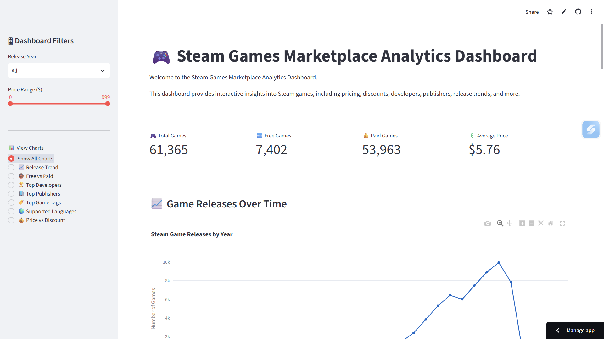
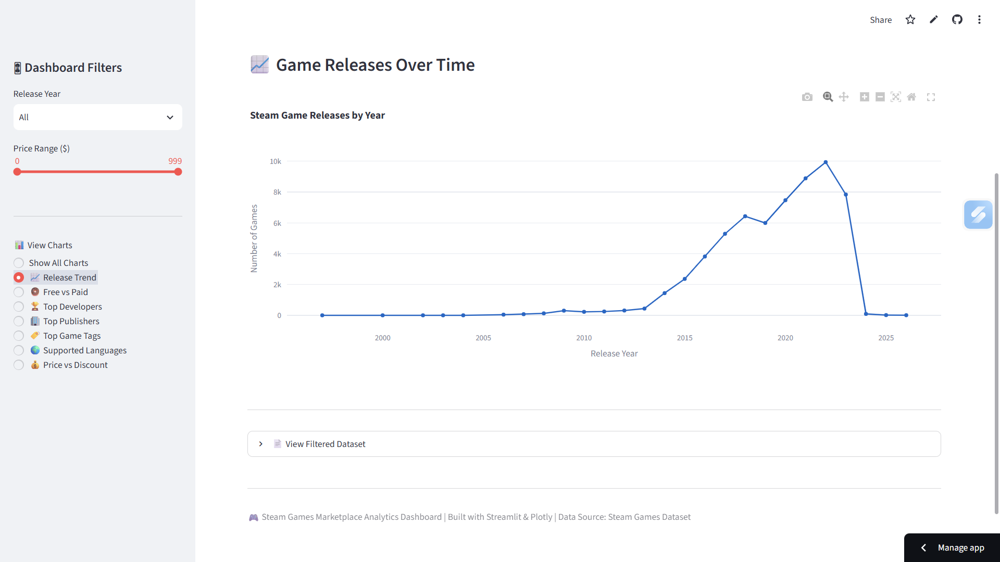
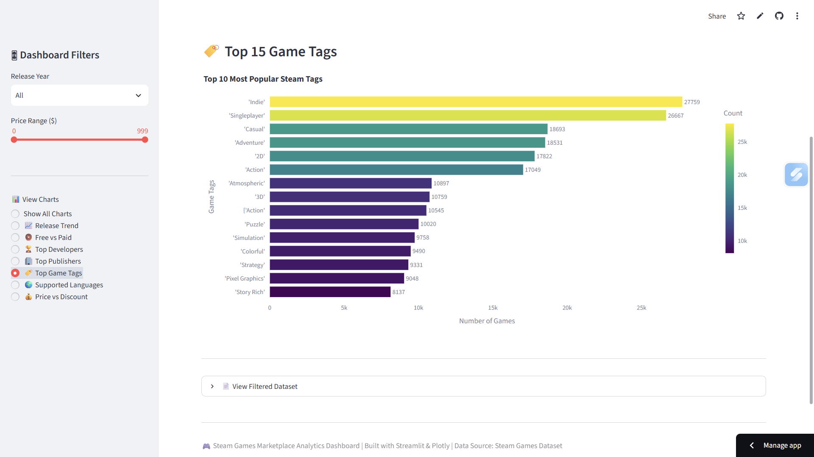
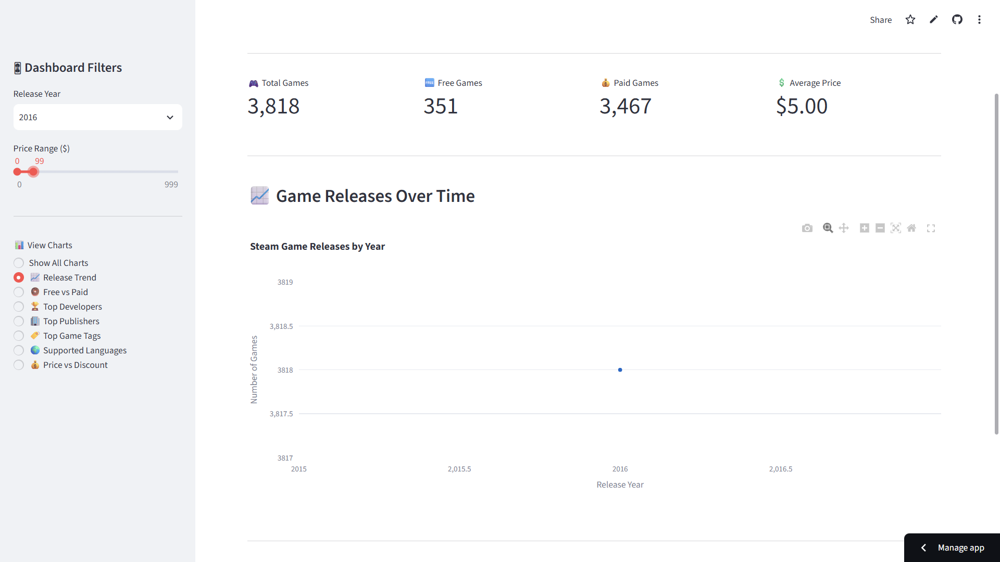

# Steam Games Marketplace Analytics Dashboard

An interactive data visualization project that analyzes the Steam Games Marketplace dataset using **Python, Plotly, and Streamlit**. This project explores trends in game releases, pricing, discounts, developers, publishers, genres, and supported languages through analytical visualizations and an interactive dashboard.

## Project Overview

The goal of this project is to transform a real-world Steam Games dataset into meaningful insights using exploratory data analysis (EDA), interactive visualizations, and a live dashboard.

The project answers multiple analytical questions by examining relationships between various game attributes such as release year, pricing, developers, publishers, tags, and supported languages.

## Objectives

- Clean and preprocess the dataset.
- Perform exploratory data analysis (EDA).
- Answer analytical questions using data visualization.
- Identify patterns and trends in the Steam marketplace.
- Develop an interactive Streamlit dashboard.
- Deploy the dashboard on Streamlit Community Cloud.

## Note

The notebook is best viewed and executed in **Jupyter Notebook** or **Visual Studio Code (VS Code)**.

Interactive Plotly visualizations may not be displayed directly on GitHub due to GitHub's notebook rendering limitations. However, all charts and outputs are available when the notebook is opened and executed in Jupyter Notebook or VS Code.

## Dataset

**Dataset:** Steam Games Dataset

**Source:** Kaggle

The dataset contains information about Steam games including:

- Game Title
- Original Price
- Discounted Price
- Release Date
- Developers
- Publishers
- Popular Tags
- Supported Languages
- Reviews

##  Features

- Interactive Plotly visualizations
- Steam marketplace analytics
- Release trend analysis
- Free vs Paid games comparison
- Top Developers
- Top Publishers
- Most Popular Game Tags
- Supported Languages Analysis
- Price vs Discount analysis
- Interactive filtering using Streamlit
- KPI Cards
- Filtered dataset viewer

# Dashboard Preview

## Dashboard Home



---

## Game Release Trend



---

## Top Game Tags



---

## Interactive Dashboard Filters



---

## Technologies Used

- Python
- Pandas
- NumPy
- Plotly
- Streamlit
- Jupyter Notebook

## Analytical Questions

1. How has the number of game releases changed over the years?
2. How are games distributed between free and paid titles?
3. What is the distribution of game prices?
4. How are discount percentages distributed?
5. Which developers have published the most games?
6. Which publishers have published the most games?
7. Which months have the highest number of game releases?
8. What are the most common game tags?
9. Which languages are most commonly supported?
10. Is there a relationship between original price and discounted price?

## Repository Structure

```
Steam-Games-Marketplace-Analytics-Dashboard
│
├── data
│   └── merged_data.csv
│
├── images
│   ├── dashboard_home.png
|   ├── Filtered Dataset Table.png
|   ├── filtered-dashboard.png
|   ├── free-vs-paid.png
│   ├── release_trend.png
│   ├── supported-language.png
│   └── top-game-tags.png
│
├── notebook
│   └── analysis.ipynb
│
├── app.py
├── README.md
├── requirements.txt

```
## How to Run

1. Clone the repository.
2. Navigate to the project folder

```bash
cd Steam-Games-Marketplace-Analytics-Dashboard
```
3. Install dependencies
```bash
pip install -r requirements.txt
```
4. Run the Streamlit application

```bash
streamlit run app.py
```

## Live Dashboard

**Streamlit Dashboard**

(https://steam-games-marketplace-dashboard.streamlit.app/)

## Key Findings

- Most Steam games are paid titles.
- Most games are priced below $200.
- Game releases vary throughout the year.
- A few developers and publishers dominate the marketplace.
- Action and Adventure are among the most common game tags.
- English is the most widely supported language.
- Discounted prices generally increase with original prices.

## Author

**Mithilesh Babu**

M.Sc. Data Science
University of Europe for Applied Sciences (UE)

---

## Acknowledgements

- Kaggle for providing the dataset
- Plotly for interactive visualization
- Streamlit for dashboard deployment
- GitHub for project hosting
